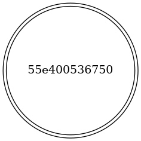
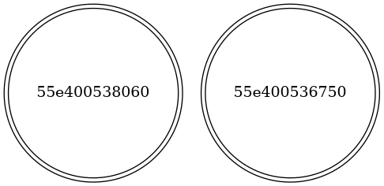
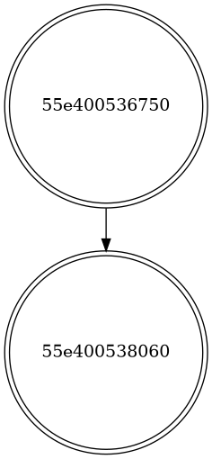
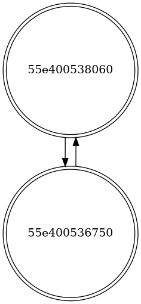
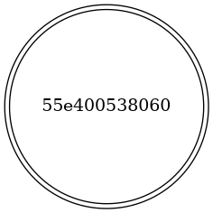
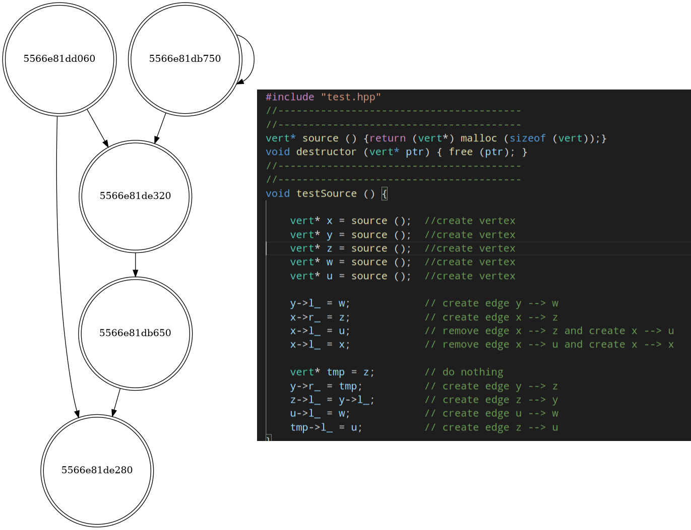

# How to build a project
```
  $ mkdir build
  $ cd build
  $ cmake ..
  $ make
```
## Compiler settings:
```
  $ cxx_std_20
```
---
### In a folder 'build' a file 'dta' monitoring 'test.cpp' will appear 
---
# A few words about the program
### My program provide monitoring the dependences in dynamically allocated memory via **QuarkslaB Dynamic binary Instrumentation** (QBDI). Some operations ***(allocation, "binding pointers", deletion)*** lead to changes in the control-flow graph, and making a dump of **.dot** files in your working directory.
* N.B: You can try to generate pictures of every step due to the **.sh** script in the root folder of cloned repository. You should create a folder **'Pics'** and execute the script. After execution pictures will be appear in the folder 

## **Make sure you has *QBDI* and *graphviz* installed** 
```
$ mkdir pics
$ bash dump.sh
```
#### P.S: If you had some troubles with bash-scripts (probably, you may try build the project on Win32-system). The try to generate pictures *by hand* via **graphviz**:
```
$ cd build
$ dot -Tpng out<N>.dot -o out<N>.png
$ xdg-open out<N>.png
```
---
## Steps of implementation:
* Detect memory allocation function call
* Remember allocated memory 
* Detect **MOV**-instructions and check they operand's values 
* Bind pointers in the **graph** if there is an attempt to write allocated memory in allocated memory
* Don't forget to delete node and unwind dependences if there is deletion function call  
---
# Test program
```cpp
// ====================================== 
// C-style allocation
// ======================================
struct vert {

    vert* l_;
    vert* r_;
};

vert* source () { return (vert*) mallo (sizeof (vert));}
void destructor (vert* ptr) { free (ptr); }

void testSource () {

    vert* x = source ();  //create vertex 
    vert* y = source ();  //create vertex
    
    x->l_ = y;            //create an edge x --> y
    y->r_ = x;            //create an edge y --> x
    destructor (x);       //remove edge x --> y and all the incidental edges
    destructor (y);       //the same
}
```
# Building graph

## Create X:
<p align = "center">

</p>

## Create Y:
<p align = "center">

</p>

## Create dependence:
<p align = "center">

</p>

## Create inverse dependence:
<p align = "center">

</p>

## Delete X:

<p align = "center">

</p>

---
# Just an amusing picture :) 

<p align = "center">

</p>

## All in all, I try to do the next task as soon as possible and its implementation will be more exciting  
---
# Useful materials: 
* https://github.com/QBDI/QBDI --> the official GitHub of QBDI-tools
*  **Practical Binary Analysis: Build Your Own Linux Tools for Binary Instrumentation, Analysis, and Disassembly** by Dennis Andriesse [Illustrated Edition]
